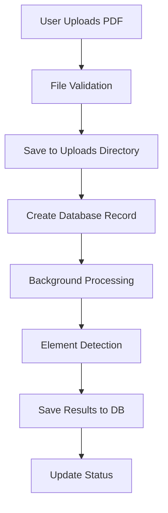
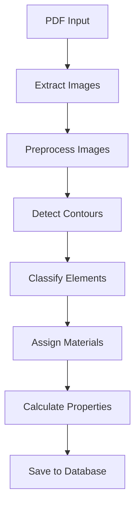
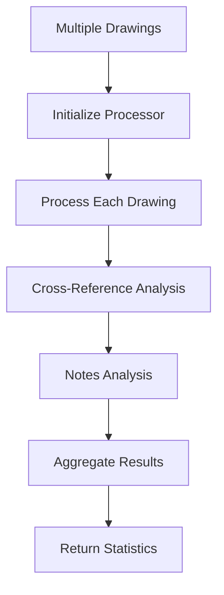

# Construction AI Platform - Core Logic Documentation

## 🏗️ Architecture Overview

### **System Components**

#### 1. **Backend (FastAPI)**
- **Location**: `backend/app/`
- **Purpose**: RESTful API server with ML processing capabilities
- **Key Features**:
  - PDF processing and element detection
  - Cost estimation and carbon analysis
  - Cross-drawing reference analysis
  - Drawing notes extraction

#### 2. **Frontend (Next.js)**
- **Location**: `frontend/src/`
- **Purpose**: React-based web interface
- **Key Features**:
  - Project management dashboard
  - Drawing upload and visualization
  - Analysis results display
  - Batch processing interface

#### 3. **ML Pipeline**
- **Location**: `ml/`
- **Purpose**: AI/ML models for construction drawing analysis
- **Key Features**:
  - Multi-head inference system
  - OCR text extraction
  - Element detection and classification
  - Cost and carbon calculations

## 🔧 Core Processing Flow

### **1. Drawing Upload & Processing**



**Key Functions**:
- `upload_drawing()`: Handles file upload and validation
- `process_pdf_drawing()`: Background task for PDF processing
- `PDFProcessor.process_pdf_drawing()`: Core processing logic

### **2. Element Detection Pipeline**



**Key Functions**:
- `_extract_images_from_pdf()`: Converts PDF pages to images
- `_detect_elements_by_discipline()`: Unified element detection
- `_geometric_detection()`: Fallback geometric analysis

### **3. Batch Processing**



**Key Functions**:
- `batch_enhanced_analysis_project()`: Main batch processing endpoint
- `_process_drawings_batch()`: Orchestrates batch processing
- `_process_single_drawing()`: Individual drawing processing

## 📊 Data Models

### **Core Entities**

#### **Project**
```python
class Project:
    id: int
    name: str
    description: str
    client_name: str
    project_type: str
    location: str
    total_area: float
    status: str
    created_at: datetime
```

#### **Drawing**
```python
class Drawing:
    id: int
    project_id: int
    filename: str
    file_path: str
    discipline: str  # architectural, structural, civil, mep
    processing_status: str  # pending, processing, completed, failed
    created_at: datetime
```

#### **Element**
```python
class Element:
    id: int
    drawing_id: int
    element_type: str  # wall, door, window, beam, column, etc.
    quantity: float
    unit: str  # m2, m3, unit, etc.
    area: float
    confidence_score: float
```

## 🔍 Key Algorithms

### **1. Element Detection Algorithm**

**Purpose**: Detect construction elements in drawings using geometric analysis

**Process**:
1. **Image Preprocessing**: Convert to grayscale, apply filters
2. **Contour Detection**: Find closed shapes using OpenCV
3. **Element Classification**: Use aspect ratio and area to classify elements
4. **Confidence Scoring**: Assign confidence based on geometric properties

**Configuration**:
```python
detection_configs = {
    "architectural": {
        "elements": [
            {"type": "wall", "aspect_ratio": (3, inf), "area_range": (1000, inf)},
            {"type": "door", "aspect_ratio": (0.3, 0.8), "area_range": (500, 5000)},
            {"type": "window", "aspect_ratio": (0.5, 2.0), "area_range": (100, 2000)}
        ]
    }
}
```

### **2. Cross-Reference Analysis**

**Purpose**: Find references between drawings for improved accuracy

**Process**:
1. **Text Extraction**: Extract text from drawings using OCR
2. **Pattern Matching**: Find reference patterns (A-A, SECTION 1, etc.)
3. **Symbol Detection**: Detect reference symbols and marks
4. **Element Matching**: Match elements across drawings
5. **Confidence Calculation**: Calculate cross-reference confidence

### **3. Cost Estimation Algorithm**

**Purpose**: Estimate construction costs based on detected elements

**Process**:
1. **Element Quantification**: Calculate quantities from detected elements
2. **Material Assignment**: Assign materials to elements
3. **Rate Application**: Apply cost rates from database
4. **Adjustment Factors**: Apply project-specific adjustments
5. **Total Calculation**: Sum all costs with overhead

## 🛠️ Error Handling Strategy

### **1. Graceful Degradation**

**Principle**: System continues working even when ML components fail

**Implementation**:
```python
def _initialize_component(self, component_name: str, is_available: bool, initializer_func):
    """Initialize a component with error handling."""
    if not is_available:
        return None
    
    try:
        component = initializer_func()
        logger.info(f"{component_name.title()} initialized successfully")
        return component
    except Exception as e:
        logger.warning(f"Failed to initialize {component_name}: {e}")
        return None
```

### **2. Comprehensive Logging**

**Purpose**: Track system behavior and debug issues

**Implementation**:
- File and console logging
- Request/response logging
- Performance timing
- Error tracking with stack traces

### **3. Health Checks**

**Purpose**: Monitor system status and dependencies

**Endpoints**:
- `/health`: Basic health check
- `/`: System information
- Database connectivity checks

## 🔄 Performance Optimizations

### **1. Background Processing**

**Purpose**: Avoid blocking API requests during heavy processing

**Implementation**:
```python
# Use FastAPI background tasks
background_tasks.add_task(process_pdf_drawing, drawing.id, file_path, discipline, db)
```

### **2. Batch Processing**

**Purpose**: Process multiple drawings efficiently

**Implementation**:
- Parallel processing where possible
- Progress tracking
- Comprehensive error handling
- Statistics aggregation

### **3. Caching Strategy**

**Purpose**: Reduce redundant processing

**Implementation**:
- Cache processed results
- Cache ML model outputs
- Cache frequently accessed data

## 🔒 Security Considerations

### **1. File Upload Security**

**Measures**:
- File type validation
- File size limits
- Secure file storage
- Virus scanning (future)

### **2. API Security**

**Measures**:
- Input validation
- SQL injection prevention
- CORS configuration
- Rate limiting (future)

## 📈 Monitoring & Observability

### **1. Health Monitoring**

**Metrics**:
- System uptime
- Response times
- Error rates
- Resource usage

### **2. Business Metrics**

**Metrics**:
- Drawings processed
- Elements detected
- Processing success rate
- User activity

## 🚀 Deployment Architecture

### **1. Development Environment**

**Components**:
- Backend: FastAPI on port 8000
- Frontend: Next.js on port 3000
- Database: SQLite
- ML Models: Local files

### **2. Production Considerations**

**Components**:
- Backend: Containerized with Docker
- Frontend: Static build with CDN
- Database: PostgreSQL
- ML Models: Cloud storage
- Caching: Redis
- Monitoring: Prometheus/Grafana

## 🔧 Maintenance Procedures

### **1. Regular Tasks**

**Daily**:
- Check system health
- Monitor error logs
- Verify ML model performance

**Weekly**:
- Update dependencies
- Backup database
- Review performance metrics

**Monthly**:
- Security updates
- ML model retraining
- System optimization

### **2. Troubleshooting**

**Common Issues**:
1. **ML Dependencies Missing**: Graceful fallback to geometric detection
2. **File Upload Failures**: Check file permissions and disk space
3. **Processing Timeouts**: Increase timeout limits or optimize algorithms
4. **Memory Issues**: Implement image resizing and batch processing

## 📚 Future Enhancements

### **1. Planned Features**

- **Real-time Processing**: WebSocket-based live updates
- **Advanced OCR**: Better text extraction and understanding
- **3D Visualization**: 3D model generation from 2D drawings
- **Mobile App**: Native mobile application

### **2. Performance Improvements**

- **GPU Acceleration**: Leverage GPU for ML processing
- **Distributed Processing**: Scale across multiple servers
- **Caching Layer**: Redis for frequently accessed data
- **CDN Integration**: Faster static asset delivery

---

**Last Updated**: January 2025
**Version**: 1.0.0
**Maintainer**: Development Team 